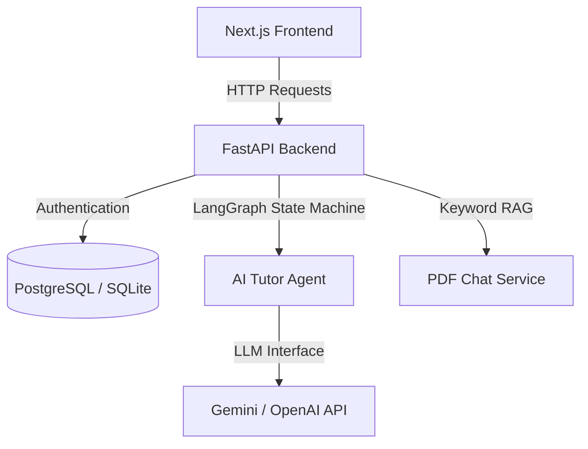
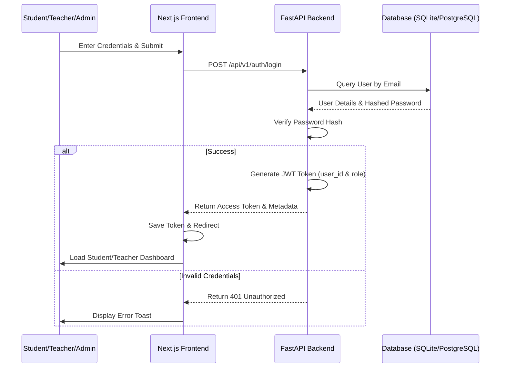
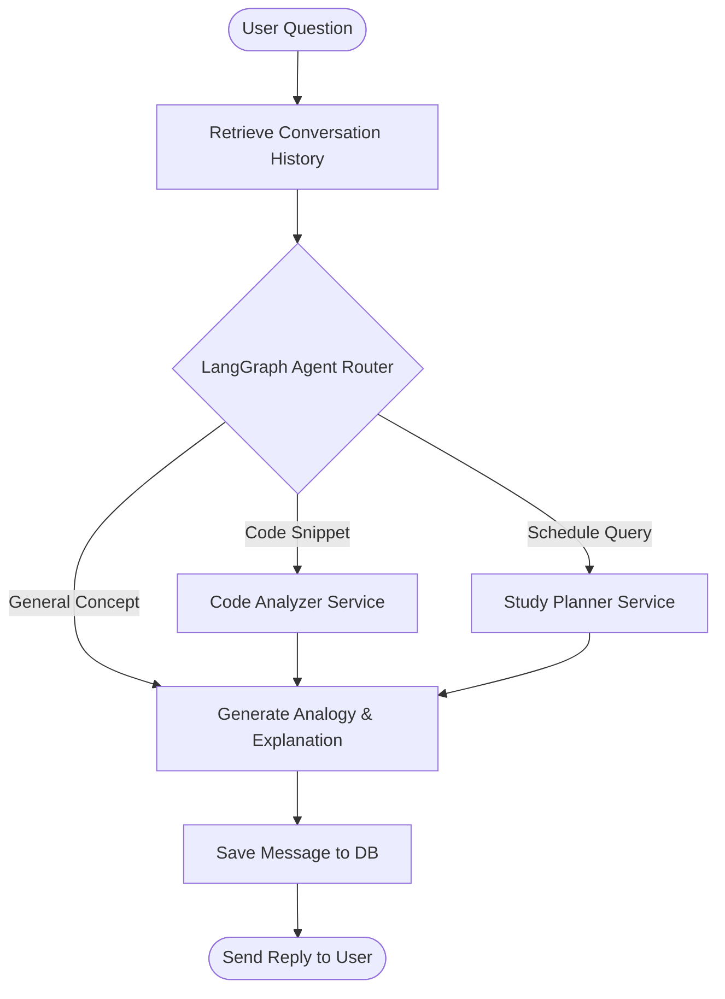
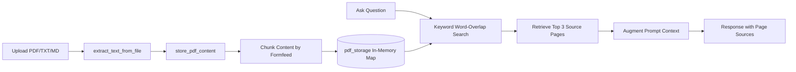

# StudyMentor AI

StudyMentor AI is a next-generation collaborative AI classroom and learning management system. Powered by LangGraph agents, it helps students generate study plans, practice quizzes, summarize lecture notes, chat with PDF textbooks, and debug code snippets in an interactive sandbox. It also provides teachers and admins with a dashboard to monitor engagement and progress metrics.

---

## Architecture Overview

StudyMentor AI uses a decoupled client-server architecture:



### Decoupled Stack
- **Frontend**: Next.js 15 (App Router), React 19, TypeScript, Tailwind CSS, Framer Motion, Lucide Icons.
- **Backend**: FastAPI (Python 3.13), SQLAlchemy ORM, Pydantic v2, PyJWT.
- **AI Engine**: LangGraph & LangChain, integrating Gemini 1.5 Flash and OpenAI GPT-4o-mini.
- **Database**: PostgreSQL (Production) / SQLite (Local fallback).

---

## Features

1. **AI Tutor Chat**: Live conversational memory powered by LangGraph to explain concepts with analogies.
2. **Smart Quiz Generator**: Generates custom multiple-choice quizzes with explanations.
3. **AI Study Planner**: Formulates weekly timetables and task lists.
4. **PDF Document Chat**: Local keyword-based RAG indexing and sourcing over uploaded documents.
5. **Coding Playground**: AI sandbox diagnosing syntax and logic issues in Python and JavaScript.
6. **Analytics Hub**: Dashboard visualizations tracking active students, quiz scores, and study hours.
7. **Role-Based Portals**: Dedicated workspaces for Students, Teachers, and Admins.

---

## 🔄 System Workflows & Data Flows

### 1. User Authentication & Authorization Flow


### 2. AI Tutor Agent Flow (LangGraph State Machine)


### 3. PDF Upload & Chat RAG Pipeline


---

## 🛠️ Local Setup

### Backend Setup
1. Navigate to the backend directory:
   ```bash
   cd backend
   ```
2. Create and activate a Python virtual environment:
   ```bash
   python3 -m venv .venv
   source .venv/bin/activate
   ```
3. Install dependencies:
   ```bash
   pip install -r requirements.txt
   ```
4. Create a `.env` file:
   ```ini
   DATABASE_URL=sqlite:///study_mentor.db
   JWT_SECRET=supersecretjwtkeyforstudymentorai2026
   GEMINI_API_KEY=your_gemini_api_key
   OPENAI_API_KEY=your_openai_api_key
   ```
5. Run the server:
   ```bash
   PYTHONPATH=. uvicorn app.main:app --reload --port 8000
   ```

### Frontend Setup
1. Navigate to the frontend directory:
   ```bash
   cd frontend
   ```
2. Install dependencies:
   ```bash
   npm install --legacy-peer-deps
   ```
3. Create a `.env.local` file:
   ```ini
   NEXT_PUBLIC_API_URL=http://localhost:8000/api/v1
   ```
4. Run the development server:
   ```bash
   npm run dev
   ```
5. Open [http://localhost:3000](http://localhost:3000) in your browser.

---

## Testing

Run the backend integration test suite:
```bash
cd backend
PYTHONPATH=. .venv/bin/pytest tests
```

---

## Containerization (Docker)

Spin up the entire application stack including PostgreSQL using Docker Compose:

```bash
docker-compose up --build
```

---

## Deployment Guide

### Frontend (Vercel)
1. Import the root repository or the `frontend/` folder into Vercel.
2. Set Environment Variables:
   - `NEXT_PUBLIC_API_URL`: Your deployed backend URL (e.g. `https://api.yourstartup.com/api/v1`).
3. Deploy!

### Backend (Railway / Render)
1. Deploy the `backend/` directory as a web service.
2. Provision a PostgreSQL Database add-on.
3. Configure Environment Variables:
   - `DATABASE_URL`: Injected automatically by Railway, or manually configure.
   - `JWT_SECRET`: A secure random secret.
   - `GEMINI_API_KEY` / `OPENAI_API_KEY`: API keys for LLM features.
